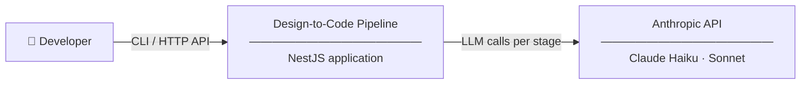
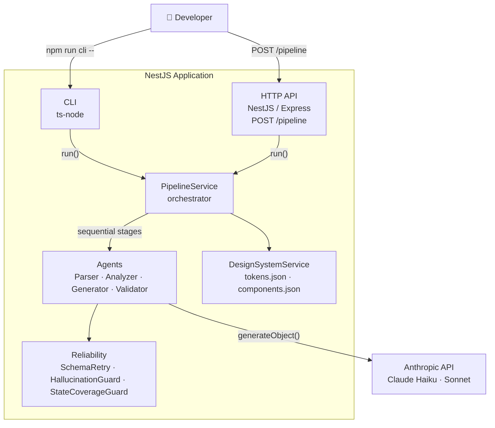
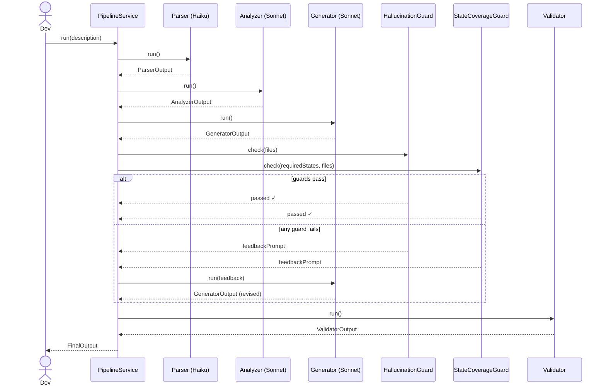

# unlimit-test — Design-to-Code Pipeline Agent

A multi-agent NestJS pipeline that takes a UI component description and produces a
React component with design system compliance, state coverage analysis, and
accessibility validation.

---

## Quick Start

**Prerequisites:** Node.js >=20.13

```bash
cp .env.example .env          # add ANTHROPIC_API_KEY
npm install
npm run cli -- examples/01-payment-card/input.txt
```

The HTTP API is also available:

```bash
npm run start:dev             # starts on port 3000
curl -X POST http://localhost:3000/pipeline \
  -H "Content-Type: application/json" \
  -d '{"description": "Payment card component..."}'
```

### Environment variables

| Variable | Required | Default | Description |
|---|---|---|---|
| `ANTHROPIC_API_KEY` | ✅ | — | Anthropic API key |
| `MODEL_PARSER` | | `claude-haiku-4-5` | Model for Parser stage |
| `MODEL_ANALYZER` | | `claude-sonnet-4-6` | Model for Analyzer stage |
| `MODEL_GENERATOR` | | `claude-sonnet-4-6` | Model for Generator stage |
| `MODEL_JUDGE` | | `claude-haiku-4-5` | Model for LLMJudge stage |
| `USE_LLM_JUDGE` | | `false` | Enable opt-in a11y scoring stage |
| `MAX_RETRIES` | | `3` | Schema retry attempts per stage |

### Tests

```bash
npm test              # run all unit tests
npm run test:cov      # with coverage report
```

35 unit tests cover the reliability sub-system: `SchemaRetry`, `HallucinationGuard`, and `StateCoverageGuard`.

---

## Pipeline Architecture

```
Input (text description)
        │
        ▼
┌─────────────┐    Extracts: component type, states,
│   Parser    │    tokens, business context
│  (Haiku)    │
└──────┬──────┘
       │
       ▼
┌─────────────┐    Identifies: missing states,
│  Analyzer   │    accessibility gaps, recommendations
│  (Sonnet)   │
└──────┬──────┘
       │
       ▼
┌─────────────┐    Generates: React component using
│  Generator  │    DS tokens and covering all states
│  (Sonnet)   │
└──────┬──────┘
       │
       ▼
┌─────────────┐    Checks: token compliance,
│  Validator  │    state coverage, accessibility rules
│ (no LLM)   │
└──────┬──────┘
       │
       ▼
  FinalOutput (JSON)
```

### C1 — System Context



### C2 — Containers



Each stage has a typed Zod schema. Structured output is handled by the Vercel AI SDK
(`generateObject`). On schema validation failure, `SchemaRetry` re-prompts the model
with per-field error feedback (up to 3 attempts).

### Request flow with self-correction



### Reliability sub-system

Validation runs without any LLM calls:

- **SchemaRetry** — wraps every LLM call; re-prompts with Zod error details on failure
- **HallucinationGuard** — checks generated code against DS token and component allow-lists
- **StateCoverageGuard** — verifies every required state is implemented in the generated code
- **LLMJudge** — opt-in a11y scoring via `USE_LLM_JUDGE=true` (uses Haiku)

### Model strategy

| Stage     | Model  | Reason                                      |
|-----------|--------|---------------------------------------------|
| Parser    | Haiku  | Structured extraction — low reasoning load  |
| Analyzer  | Sonnet | Gap analysis requires DS knowledge          |
| Generator | Sonnet | Code generation with DS constraints         |
| LLMJudge  | Haiku  | Rubric scoring — structured output          |

All models are overridable via ENV: `MODEL_PARSER`, `MODEL_ANALYZER`, `MODEL_GENERATOR`, `MODEL_JUDGE`.

---

## Examples

Three worked examples are in `examples/`. Each contains `input.txt`, `output.json`,
and the generated `Component.tsx`.

| Example | States coverage | Token compliance | A11y score |
|---|---|---|---|
| Payment card | 7/7 | ✅ | 4/4 |
| Transaction table | 4/13 | ✅ | 5/5 |
| KYC wizard | 6/19 | ✅ | 7/7 |

To regenerate all examples:

```bash
npm run run:examples
```

---

## Architecture Decisions

Three ADRs in `docs/adr/` document the key choices:

- **[ADR-001](docs/adr/ADR-001-manual-orchestration.md)** — Manual orchestration over AI frameworks (LangChain/LlamaIndex)
- **[ADR-002](docs/adr/ADR-002-deterministic-first-reliability.md)** — Deterministic-first reliability (no LLM in the default validation path)
- **[ADR-003](docs/adr/ADR-003-mixed-model-strategy.md)** — Mixed-model strategy for cost optimisation

---

## Trade-offs and Known Limitations

**Results are non-deterministic.** Re-running the same input may produce different coverage scores — LLM outputs vary between calls even at `temperature=0` due to sampling. The examples show one representative run.

**State coverage gaps surface actionable feedback.** When the Generator misses states,
`StateCoverageGuard` identifies exactly which ones are absent and feeds that back into a
retry. For example, the KYC wizard has 18 required states — uncovered states are not
silently ignored but reported in `validation.issues_found` and trigger a targeted
re-generation. Better prompt decomposition (generate each wizard step separately)
would improve first-pass coverage on complex components.

**StateCoverageGuard uses regex, not AST.** Regex patterns scoped to JSX operators
(`&&`, `?`) work well for the generated code style but can miss states implemented
via CSS-in-JS or inline `<style>` blocks. AST-based analysis would be more accurate
but adds significant complexity.

**Design system is a stub.** `design-system/tokens.json` and `components.json` are
representative fixtures, not a real DS. A production integration would connect to
Figma Tokens, Style Dictionary, or a component registry.

---

## AI Usage

This project was developed with Claude (Anthropic) as an AI assistant — used for
architecture design, code generation, prompt engineering, and iterative debugging.
The pipeline architecture, reliability mechanisms, and ADRs reflect decisions made
collaboratively with AI tooling throughout the process.

**Model:** Claude (Anthropic) — `claude-sonnet-4-6` for Analyzer and Generator,
`claude-haiku-4-5` for Parser and the optional LLM judge.

**Where AI was used:**

- *Parser* — structured extraction of component type, states, tokens, and business context from free-text descriptions
- *Analyzer* — gap analysis: identifying missing states and accessibility issues not mentioned in the description
- *Generator* — React component generation using design system constraints
- *LLMJudge (opt-in)* — accessibility scoring with per-category breakdown

**What worked well:**

- `generateObject` with Zod schemas produces reliable structured output; schema failures are rare and self-correct via `SchemaRetry`
- Haiku is sufficient for extraction and scoring tasks — no quality loss observed compared to Sonnet for those stages
- The Analyzer reliably surfaces missing states (hover, focus, loading, error) even when the input description says nothing about them

**What didn't work as well:**

- State coverage on complex components improves after the retry loop but is not always complete — decomposing the prompt per wizard step would help further
- Generated component code is functional but not idiomatic — structure, naming, and separation of concerns reflect prompt instructions rather than team conventions
- `StateCoverageGuard` regex patterns miss some valid state implementations, leading to false negatives in the coverage report
